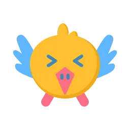

# <i class="fa-solid fa-bird"></i> Flappy Bird Game

A modern, browser-based Flappy Bird game built with React, Vite, and DaisyUI. Experience the classic arcade gameplay with stunning visuals, multiple themes, and immersive audio in this fully-featured web application.



## <i class="fa-solid fa-sparkles"></i> Features

### <i class="fa-solid fa-gamepad"></i> Core Gameplay
- **Classic Flappy Bird Mechanics**: Navigate through pipes with precise bird physics
- **Smooth 60fps Gameplay**: Optimized game loop with delta time handling
- **Responsive Controls**: Click or spacebar to control the bird
- **Collision Detection**: Accurate hit detection for pipes and ground
- **Score Tracking**: Real-time scoring with high score persistence

### <i class="fa-solid fa-palette"></i> Visual Design
- **29 Beautiful Themes**: Complete DaisyUI theme support including:
  - Light, Dark, Cupcake, Bumblebee, Emerald
  - Corporate, Synthwave, Retro, Cyberpunk
  - Valentine, Halloween, Garden, Forest
  - Aqua, Lofi, Pastel, Fantasy, and more!
- **Dynamic Backgrounds**: Gradient skies with animated clouds
- **Visual Effects**: Bird wing animations, pipe gradients, and ground textures
- **Responsive Canvas**: Full-screen gameplay that adapts to any screen size

### <i class="fa-solid fa-volume-up"></i> Audio System
- **Immersive Sound Effects**: Web Audio API integration
- **Multiple Sound Types**: Different tones for scoring, collisions, and interactions
- **Volume Control**: Adjustable audio levels through settings
- **Performance Optimized**: Efficient audio playback without external files

### <i class="fa-solid fa-cog"></i> Settings & Customization
- **Theme Selection**: Choose from 29 professionally designed themes
- **Volume Adjustment**: Fine-tune audio experience
- **Persistent Settings**: Your preferences are saved locally
- **Intuitive Interface**: Clean modal-based settings system

### <i class="fa-solid fa-trophy"></i> Leaderboard System
- **Local High Scores**: Track your best performances
- **Score History**: Maintain a leaderboard of recent games
- **Easy Access**: Quick leaderboard viewing from the top bar

## <i class="fa-solid fa-rocket"></i> Quick Start

### Prerequisites
- Node.js (v16 or higher)
- npm or yarn package manager

### Installation

1. **Clone the repository**
   ```bash
   git clone https://github.com/YashPalav-26/daisy-flappy.git
   cd daisy-flappy
   ```

2. **Install dependencies**
   ```bash
   npm install
   ```

3. **Start the development server**
   ```bash
   npm run dev
   ```

4. **Open your browser**
   Navigate to `http://localhost:5173` to start playing!

### Available Scripts

- `npm run dev` - Start development server
- `npm run build` - Build for production
- `npm run preview` - Preview production build
- `npm run lint` - Run ESLint

## <i class="fa-solid fa-bullseye"></i> How to Play

1. **Start**: Click anywhere or press the spacebar to begin
2. **Fly**: Click or press spacebar to make the bird flap and gain height
3. **Navigate**: Guide the bird through the gaps between pipes
4. **Score**: Earn points for each pipe successfully passed
5. **Survive**: Avoid hitting pipes or the ground
6. **Restart**: After game over, click or press spacebar to play again

## <i class="fa-solid fa-hammer"></i> Technical Architecture

### Frontend Stack
- **React 19**: Modern React with hooks and functional components
- **Vite**: Lightning-fast build tool and development server
- **Tailwind CSS**: Utility-first CSS framework
- **DaisyUI**: Beautiful component library with 29 themes

### Game Engine
- **HTML5 Canvas**: Hardware-accelerated 2D rendering
- **Custom Physics**: Realistic gravity and collision systems
- **Modular Design**: Separated concerns with custom hooks
- **Performance Optimized**: Efficient rendering and memory management

### Project Structure
```
src/
├── components/          # React components
│   ├── Game.jsx        # Main game component
│   ├── TopBar.jsx      # Navigation header
│   ├── SettingsModal.jsx
│   └── LeaderboardModal.jsx
├── hooks/              # Custom React hooks
│   ├── useGameEngine.js
│   ├── useGameState.js
│   ├── useTheme.js
│   └── useAudio.js
├── config/             # Configuration files
│   ├── gameConfig.js   # Game parameters
│   └── themes.js       # Theme definitions
└── utils/              # Utility functions
    └── drawing.js      # Canvas drawing utilities
```

### Key Components

#### Game Engine (`useGameEngine.js`)
- Manages bird physics and movement
- Handles pipe generation and collision detection
- Controls game state transitions
- Implements spawn timers and scoring

#### Theme System (`useTheme.js`)
- Dynamic theme switching across all 29 DaisyUI themes
- Color palette management for consistent styling
- Real-time theme updates without page refresh

#### Audio System (`useAudio.js`)
- Web Audio API integration for sound effects
- Volume control and audio context management
- Multiple sound types for different game events

## <i class="fa-solid fa-palette"></i> Customization

### Adding New Themes
1. Add theme colors to `src/config/themes.js`
2. Follow the existing color structure:
   ```javascript
   'your-theme': {
     primary: '#your-color',
     secondary: '#your-color',
     // ... other color properties
   }
   ```

### Modifying Game Physics
Adjust game parameters in `src/config/gameConfig.js`:
- `BIRD_GRAVITY`: Controls bird fall speed
- `BIRD_JUMP_VELOCITY`: Controls jump height
- `PIPE_GAP`: Adjusts difficulty
- `PIPE_SPEED`: Controls game pace

## <i class="fa-solid fa-handshake"></i> Contributing

We welcome contributions! Here's how you can help:

1. **Fork the repository**
2. **Create a feature branch**: `git checkout -b feature/amazing-feature`
3. **Make your changes** and test thoroughly
4. **Commit your changes**: `git commit -m 'Add amazing feature'`
5. **Push to the branch**: `git push origin feature/amazing-feature`
6. **Open a Pull Request**

### Development Guidelines
- Follow React best practices and hooks patterns
- Maintain consistent code style with ESLint
- Test across different themes and screen sizes
- Ensure audio works across different browsers
- Keep performance optimized for smooth 60fps gameplay

## <i class="fa-solid fa-file-alt"></i> License

This project is open source and available under the [MIT License](LICENSE).

## <i class="fa-solid fa-laptop-code"></i> Author

**Yash Palav**
- Email: yashpalav48@gmail.com
- GitHub: [@YashPalav-26](https://github.com/YashPalav-26)

## <i class="fa-solid fa-hands-helping"></i> Acknowledgments

- Original Flappy Bird game concept by Dong Nguyen
- DaisyUI for the beautiful theme system
- React and Vite communities for excellent tooling
- Open source community for inspiration and support

---

**Ready to flap?** <i class="fa-solid fa-bird"></i> Start playing now and see how high you can score!

*Built with <i class="fa-solid fa-heart"></i> by Yash Palav*
